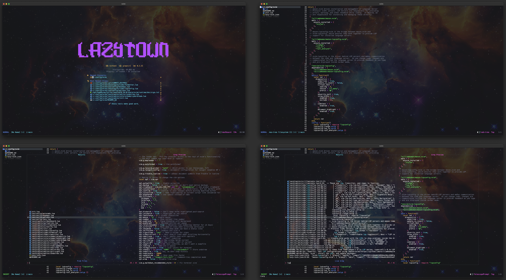

<h1 align="center">LazyTown-nvim</h1>

<div align="center">
    <a href="https://github.com/thecae/lazytown-nvim">Home</a>
</div>

<div align="center">

[](https://github.com/neovim/neovim)
[](https://github.com/thecae/lazytown-nvim/issues)
</div>

## Showcase



## What is LazyTown?

LazyTown is a lua-based Neovim configuration with expandability in mind.  All configurations are well-documented, easy to change, and easy to add more plugins.

## Installation

Requirements:

* [Neovim 0.10](https://github.com/neovim/neovim/releases/tag/v0.10.0).
* [Nerd Font](https://www.nerdfonts.com/) as your terminal font.
    * Make sure the nerd font you set doesn't end with Mono to prevent small icons.
    * Example: *Cascaydia Code Nerd Font* and not *Cascaydia Code Nerd Font Mono*
* [Ripgrep](https://github.com/BurntSushi/ripgrep) is required for grep searching with Telescope (*optional*).
* GCC, Windows users must have [`mingw`](http://mingw-w64.org/downloads) installed and set on path.
* Make, Windows users must have [`GnuWin32`](https://sourceforge.net/projects/gnuwin32) installed and set on path.
* Delete old neovim folders (check commands below)

This repository is ready by default.  Simply clone it into the `~/.config/nmvim` folder:

```bash
git clone https://github.com/thecae/lazytown-nvim.git ~/.config/nvim
```

Remove the `.git` folder so you can add your own:

```bash
rm -rf ~/.config/nvim/.git
```

Run `nvim`, install the LSPs, and update packages!

```bash
nvim

:MasonInstallAll
:Lazy sync
```

## Plugins List

- An easy to configure dashboard from [nvim-dashboard](https://github.com/nvimdev/dashboard-nvim).
- Powerful, fast LSP configurations using [mason-nvim](https://github.com/williamboman/mason.nvim) and [nvim-lspconfig](https://github.com/neovim/nvim-lspconfig).
- Code formatting with [conform.nvim](https://github.com/stevearc/conform.nvim).
- Live grep and file-finding with [nvim-treesitter](https://github.com/nvim-treesitter/nvim-treesitter).
- Informative, customizable powerline from [lualine](https://github.com/nvim-lualine/lualine.nvim).
- Autocompletion with [nvim-cmp](https://github.com/hrsh7th/nvim-cmp).
- File tree integration with [neo-tree](https://github.com/nvim-neo-tree/neo-tree.nvim).
- Easy git integration with [gitsigns](https://github.com/lewis6991/gitsigns.nvim).
- Beautiful icons from [nvim-web-devicons](https://github.com/nvim-tree/nvim-web-devicons).
- Keymap popup cheatsheets with [which-key](https://github.com/folke/which-key.nvim).

## Credits

This configuration stems takes inspiration from the base LazyVim installation but simplifies the plugin structure to allow developers to understand the installed plugins, remove what they don't want, and add what they need.

Additional inspiration is taken from ThePrimagen's 0 to LSP series, typecraft's 0 to LSP series, and various Neovim configurations on Reddit.
